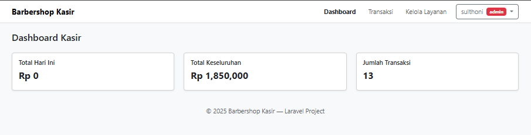
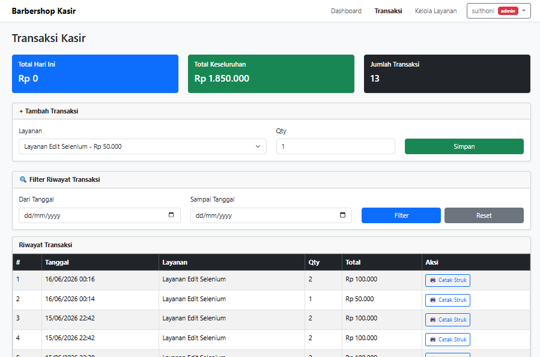

# 💈✂ Barbershop Web Application For Free 💈


Aplikasi manajemen operasional dan reservasi barbershop berbasis web yang dirancang untuk mendigitalisasi proses penjadwalan serta transaksi kasir secara real-time. Dilengkapi dengan unit pengujian otomatis berbasis Selenium WebDriver untuk memastikan stabilitas dan keandalan sistem.

Aplikasi ini berfungsi sebagai platform manajemen satu pintu (**one-stop management**) yang menghubungkan pelanggan, barber (admin), dan kasir secara langsung untuk memproses antrian, reservasi, dan pembayaran secara digital.

---

# 📸 Screenshot Aplikasi

## Login


## Dashboard Admin



## Halaman Transaksi



---

# Tujuan pembuatan Project ini

* Mengurangi kerumitan terhadap sistem pembayaran yg lebih efisien dan jauh lebih unggul dibandingkan dengan transaksi manual pada umumnya, karena sudah dijalankan/integrasi melalui by sistem perhitungan dan cetak bukti langsung.

* Gratis digunakan untuk bisnis maupun UMKM yg bekerja usaha sendiri membuka sebagai kios/tempat barbershop.

* Membantu karyawan/pengguna dalam melakukan kalkulasi biaya layanan dan mencetak bukti pembayaran (struk) secara akurat tanpa pencatatan manual.

---

# Penggunaan Sistem

Pelanggan dapat mendaftar dan memilih slot waktu luang dari barber favorit mereka. Setelah proses pencukuran selesai, kasir memproses pembayaran berdasarkan jenis layanan yang diambil, menghasilkan struk fisik/digital, dan menutup transaksi di sistem secara instan.

---

# 🌟 Fitur Utama

Sistem ini memisahkan hak akses secara dinamis berdasarkan peran pengguna untuk memastikan keamanan data dan alur kerja yang teratur.

## 👮 Admin (Tukang Cukur / Barber)

### Dasbor

* Memantau total pendapatan dan jumlah transaksi seperti:

  * Total Hari Ini
  * Total Keseluruhan
  * Jumlah Transaksi

### Transaksi

* Melakukan hal yang sama seperti kasir.
* Menambah transaksi dari kelola layanan.
* Filter riwayat transaksi menggunakan waktu.
* Cetak struk.

### Kelola Layanan

* Menambahkan nama layanan.
* Menyesuaikan kebutuhan harganya.

---

## 💻💵 Kasir (Transaksi & Pembayaran)

### Dasbor

* Memantau total pendapatan dan jumlah transaksi seperti:

  * Total Hari Ini
  * Total Keseluruhan
  * Jumlah Transaksi

### Transaksi

* Melakukan hal yang sama seperti admin.
* Menambah transaksi dari kelola layanan.
* Filter riwayat transaksi menggunakan waktu.
* Cetak struk.

---

# ⚙️ Teknologi yang Digunakan

| Komponen           | Teknologi                                 | Peran Utama                                                     |
| ------------------ | ----------------------------------------- | --------------------------------------------------------------- |
| Frontend           | HTML5, CSS3, JavaScript (ES6+), Bootstrap | Antarmuka pengguna yang responsif dan interaktif                |
| Backend            | PHP (Laravel 12)                          | Logika bisnis aplikasi, routing, dan pemrosesan basis data      |
| Database           | MySQL / MariaDB                           | Penyimpanan data relasional pengguna, jadwal, dan transaksi     |
| Automation Testing | Selenium WebDriver                        | Kerangka kerja pengujian fungsionalitas browser secara otomatis |

---

# 📂 Struktur Project

```text
kasir-barbershop-selenium
│
├── app/
├── bootstrap/
├── config/
├── database/
├── node_modules/
├── public/
├── resources/
├── routes/
│
├── screenshots/
│   ├── Login.png
│   ├── dashboard-admin.png
│   └── transaksi.png
│
├── selenium-tests/
├── storage/
├── tests/
├── vendor/
│
├── .env
├── artisan
├── composer.json
├── composer.lock
├── package.json
├── package-lock.json
├── phpunit.xml
├── README.md
├── tailwind.config.js
└── vite.config.js
```

---

# ⚙️ Persyaratan Sistem (Prerequisites)

Sebelum memasang aplikasi, pastikan komputer Anda telah memenuhi persyaratan berikut:

* **Web Server:** XAMPP / Laragon / Apache (PHP >= 8.0)
* **DBMS:** MySQL / MariaDB
* **Dependency Manager:** Composer & NPM (Node.js)
* **Runtime Pengujian:** Java JDK 11+ atau Python 3.8+ (untuk menjalankan tes Selenium)
* **Web Browser:** Google Chrome & ChromeDriver yang sesuai dengan versi Chrome Anda

---

# 🚀 Panduan Instalasi (Installation)

Ikuti langkah-langkah berikut untuk menjalankan proyek di komputer lokal Anda bisa melalui terminal Laravel ataupun CMD (dengan sesuai posisi folder direktori anda):

## 1. Clone Repository

```bash
git clone https://github.com/sulthoni12345/test-barbershop.git
cd test-barbershop
```

## 2. Install Dependencies

Mengunduh library PHP dan aset frontend:

```bash
composer install
npm install
```

## 3. Konfigurasi Environment

Salin file contoh konfigurasi dan sesuaikan dengan database lokal Anda:

```bash
cp .env.example .env
```

Buka file `.env` dan atur:

* DB_DATABASE
* DB_USERNAME
* DB_PASSWORD

## 4. Generate App Key

```bash
php artisan key:generate
```

## 5. Setup Database

Jalankan migrasi tabel dan seeder data awal:

```bash
php artisan migrate
php artisan db:seed
```

## 6. Build Assets

```bash
npm run dev
```

## 7. Jalankan Server melalui terminal Laravel/CMD

```bash
php artisan serve
```

Akses aplikasi melalui browser di:

```text
http://localhost:8000
```

---

# 📖 Cara Penggunaan

## 1. Akses Admin (Barber)

Masuk sebagai admin untuk memvalidasi pemesanan masuk dan menyusun daftar antrian dengan nama.

## 2. Akses Kasir

Cari nama pelanggan yang transaksinya selesai dengan memasukan jumlah pelanggan di bagian qty, lalu sesuaikan filter riwayat transaksi di setiap waktunya, setelah itu anda bisa melihat sesuai nama pelanggan nya yang akan melakukan pembayaran di lanjut dengan mencetak struk.

---

# 🔑 Akun Demo

## Admin

```text
Email    : test@example.com
Password : password
```

## Kasir

```text
Email    : kasir@barbershop.com
Password : kasir123
```

---

# 🧪 Selenium Automation Testing

Project ini telah dilengkapi dengan pengujian otomatis menggunakan Selenium WebDriver untuk memastikan fitur-fitur utama berjalan dengan baik.

### Fitur yang Diuji

* Login Admin
* Login Kasir
* Kelola Layanan
* Tambah Transaksi
* Filter Riwayat Transaksi
* Cetak Struk
* Logout Sistem

### Menjalankan Selenium Test

Masuk ke folder:

```bash
cd selenium-tests
```

Jalankan test:

```bash
pytest
```

atau

```bash
python -m pytest
```

---

# 🚧 Roadmap Pengembangan

* [x] Sistem Login Multi Role
* [x] Kelola Layanan
* [x] Sistem Transaksi
* [x] Cetak Struk
* [x] Selenium Automation Testing
* [ ] Payment Gateway
* [ ] WhatsApp Notification
* [ ] Email Notification
* [ ] Reservasi Online
* [ ] Dashboard Analytics
* [ ] AI Scheduling Recommendation

---

# 🤝 Kontribusi

Kami sangat menyukai kontribusi dari komunitas eksternal! Jika Anda tertarik untuk membantu mengembangkan aplikasi barbershop ini ke tingkat selanjutnya, Anda sangat dipersilakan.

Beberapa fitur masa depan yang direncanakan dan siap dikembangkan bersama:

### Integrasi Payment Gateway

Pembayaran digital non-tunai otomatis (seperti e-wallet atau transfer bank).

### Sistem Notifikasi

Pengiriman otomatis pengingat jadwal cukur ke WhatsApp atau Email pelanggan.

### Penjadwalan Berbasis AI

Rekomendasi waktu cukur terbaik berdasarkan preferensi historis pelanggan.

---

## Langkah-langkah Berkontribusi

1. Lakukan Fork pada repositori ini.

2. Buat branch fitur baru Anda.

```bash
git checkout -b fitur/FiturKerenBaru
```

3. Lakukan commit terhadap perubahan Anda.

```bash
git commit -m "Menambahkan fitur keren"
```

4. Lakukan push ke branch Anda.

```bash
git push origin fitur/FiturKerenBaru
```

5. Buat Pull Request baru di GitHub kami.

---

# 📜 License

Project ini dibuat untuk tujuan pembelajaran, pengembangan, dan implementasi sistem manajemen barbershop berbasis web.

Silakan gunakan, modifikasi, dan kembangkan sesuai kebutuhan Anda.

---

⭐ Terima kasih telah menggunakan dan berkontribusi pada proyek **Barbershop Web Application For Free**.

💈 Dibuat menggunakan Laravel, MySQL, Bootstrap, dan Selenium WebDriver.

🚀 Open Source • Free to Use • Community Driven
